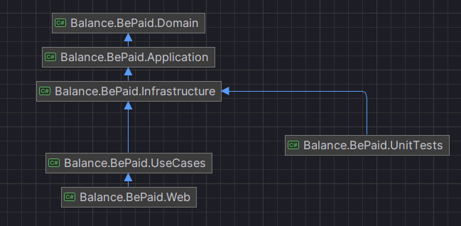

Сервис для работы с платежной системой BePaid. 

Используемый стек: .NET 8, PostgreSQL, Mediatr

В функционал сервиса входит: 
  - Привязка банковской карты к системе с помощью виджета BePaid
  - Оплата банковской картой с помощью виджета BePaid
  - Оплата сохраненной картой
  - Холдирование суммы сохраненной картой
  - Удержание суммы
  - Отмена холда
  - Отмена платежа
  - Сохранение должников и удержание с них суммы задолженности
  - Сохранение чеков на каджый тип транзакции

Для корректной работы сервиса, необходимо указать токен вашего магазина BePaid в переменные среды (или в UserSecrets в случае локальной разработки) с именем 'BEPAID_TOKEN'.
Полная конфигурация веб-хук адресов храниться в сущности PaymentSystemConfiguration. 
